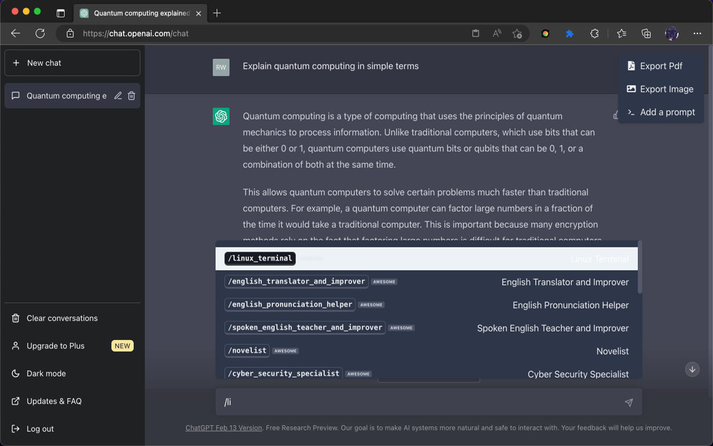
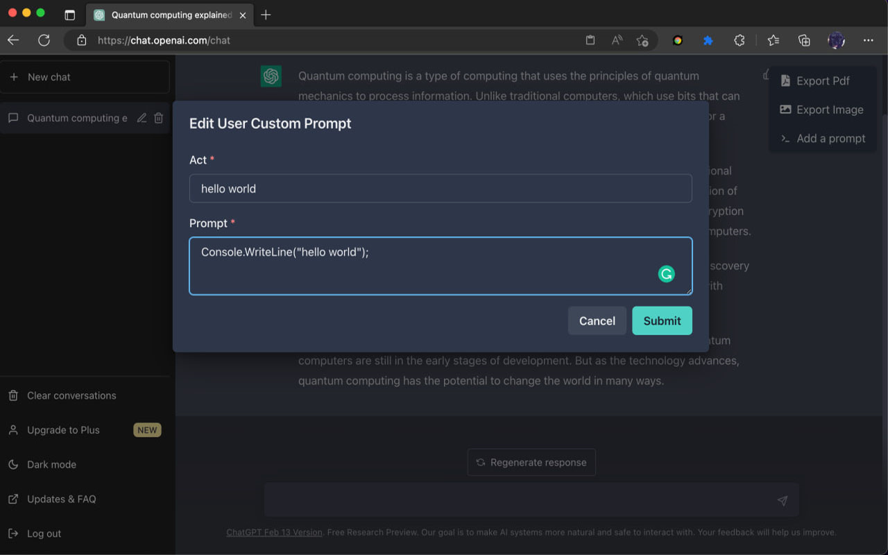
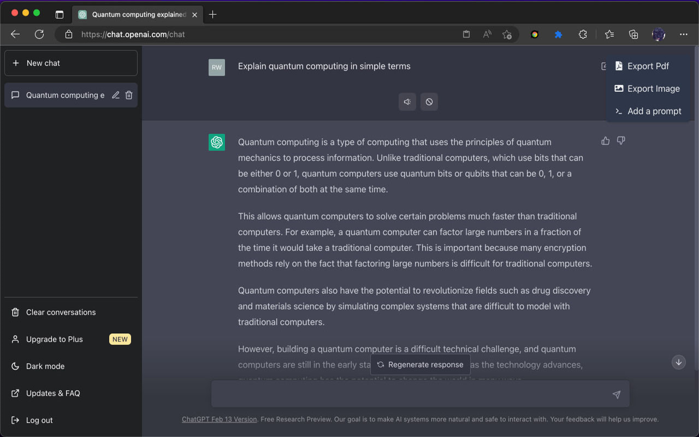

  
  <h1 align="center">Enhancer For ChatGPT</h1>
  
Enhancer for ChatGPT 是一个 Chrome&Edge 的扩展程序, 它可以帮助我们在更好的使用 chatGPT.

所有的 icons 由 OpenAI DALL·E 2 生成
 
 

## 愿景
目前 chatGPT 可是是最热门的应用了, 很多人几乎每天都要和它打交道,有的希望从中掌握技能,有的可以协助自己完成工作, 有些则是帮助自己学习语言, 相信随着大家对它的开发使用, 会需要一些辅助功能来更快捷的完成一些重复的操作. 这个扩展就是在这个想法上面创立的.

一个人的能力是有限的, 希望这个扩展能帮助到你, 同时也希望你能参与并加入它的开发.

### 指令

chatGPT 到底有多少潜力可以释放,应该取决于提问的问题精确度,网络上面已经汇集了很多优秀提示指令 [awesome-prompts](https://github.com/f/awesome-chatgpt-prompts), [jailbreakchat](https://www.jailbreakchat.com/)等等. 为了在不跳出问答窗口,快速访问提示指令, 在输入中框集成了 `/` 指令快捷键, 通过它可以更高效的访问保存的指令集. (目前已经集成了[awesome-prompts](https://github.com/f/awesome-chatgpt-prompts))

### 工具栏

受到 [lencx-ChatGPT](https://github.com/lencx/ChatGPT) 的灵感, 选择在chatGPT的页面中提供一个悬浮的工具栏, 用来进行快捷的操作, 目前支持的功能有`导出PDF`, `导出图像`, `增加自定义指令`

### 问答工具栏

对每一个问答的内容底部, 注入一个隐藏的工具栏, 它可以在需要的时候对某一个条目进行相关的操作, 目前提供的功能有 `tts speak`

## 📃 TODO

* 更方便快捷的管理指令集
* TTS 连续播放
* 通过语音输入
* 多语言支持
* ...

## 🔍 使用的技术

1. react & typescript
1. [Chakra-UI](https://chakra-ui.com/) Chakra UI is a simple, modular and accessible component library that gives you the building blocks you need to build your React applications.

## ❤️ 感谢

* https://github.com/lencx/ChatGPT
* https://github.com/f/awesome-chatgpt-prompts
* https://www.jailbreakchat.com/

## License

[MIT License](./LICENSE)