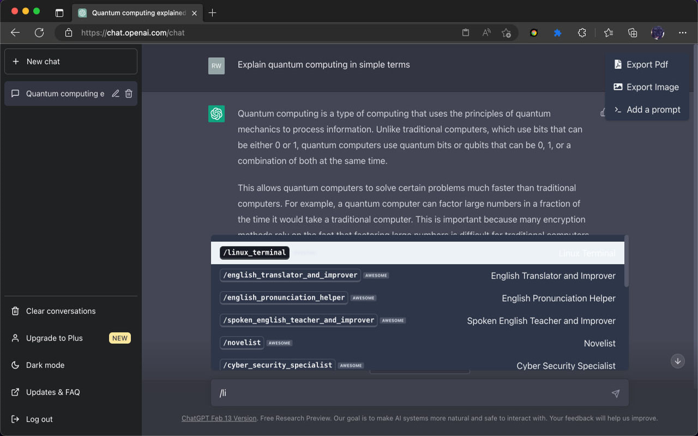
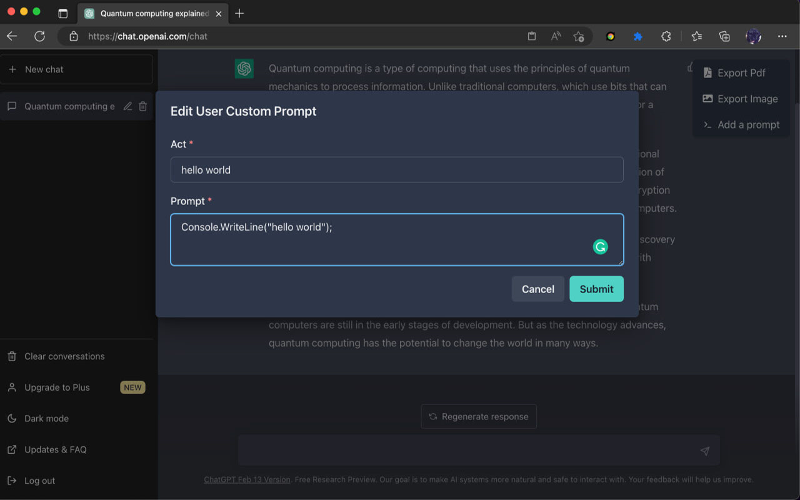
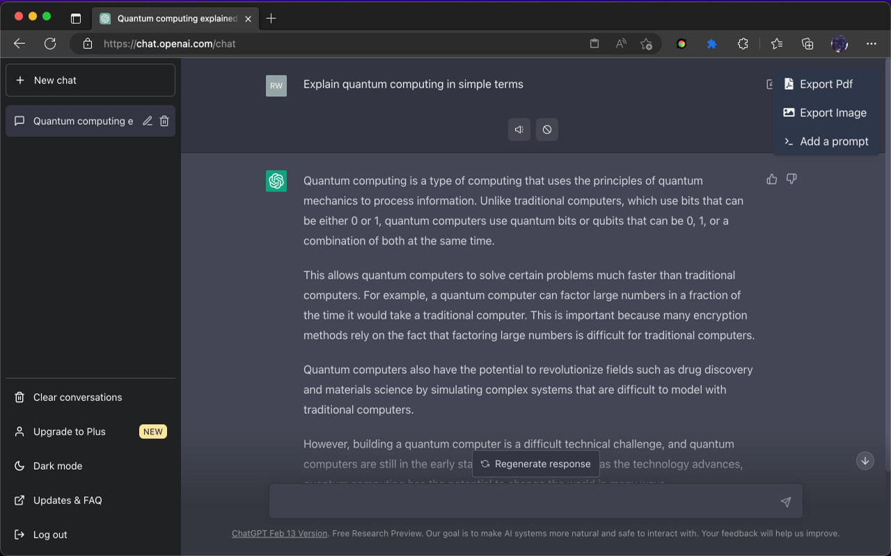

  
  <h1 align="center">Enhancer For ChatGPT</h1>
  
Enhancer for ChatGPT is a Chrome & Edge extension that helps us use ChatGPT more efficiently.

 All the icons are generated by OpenAI DALL·E 2

 
 

## Vision

Currently, ChatGPT is one of the most popular applications, with many people using it almost every day. Some hope to learn new skills, some use it to assist with their work, and others use it to learn a language. As people continue to develop and use ChatGPT, they may require some additional features to perform certain repetitive tasks more quickly. This extension was created with this idea in mind.

One person's abilities are limited, and I hope this extension can help you. I also hope you can participate and contribute to its development.

### Commands

The potential of ChatGPT depends on the accuracy of the questions asked. There are already many excellent prompt commands available on the internet, such as [awesome-prompts](https://github.com/f/awesome-chatgpt-prompts), [jailbreakchat](https://www.jailbreakchat.com/). To quickly access these commands without leaving the chat window, the / command shortcut key has been integrated into the input box to access the saved command set more efficiently. ([awesome-prompts](https://github.com/f/awesome-chatgpt-prompts) has been integrated so far)

### Tool Bar

Inspired by [lencx-ChatGPT](https://github.com/lencx/ChatGPT), a floating toolbar has been provided on the ChatGPT page for quick and easy operations. Currently, it supports functions such as export to PDF, export to image, and add custom commands.

### Q&A Tool Bar
A hidden toolbar has been injected at the bottom of each Q&A item, which can perform relevant operations on a specific item when needed. Currently, it provides functions such as TTS speak.

## 📃 TODO

* More convenient and efficient management of the command set
* Continuous TTS playback
* Voice input
* Mutiple languages
*  ...

🔍 Technologies Used

1. React & TypeScript
1. [Chakra-UI](https://chakra-ui.com/) : Chakra UI is a simple, modular, and accessible component library that provides the building blocks you need to build your React applications.

❤️ Acknowledgements

* https://github.com/lencx/ChatGPT
* https://github.com/f/awesome-chatgpt-prompts
* https://www.jailbreakchat.com/

## License

[MIT LICENSE](./LICENSE)
